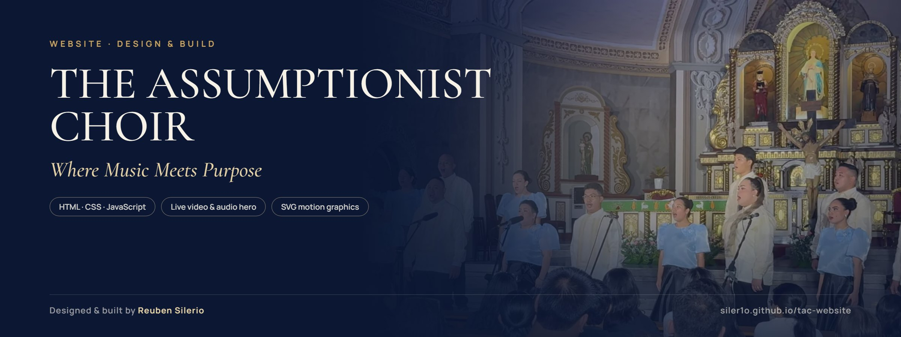
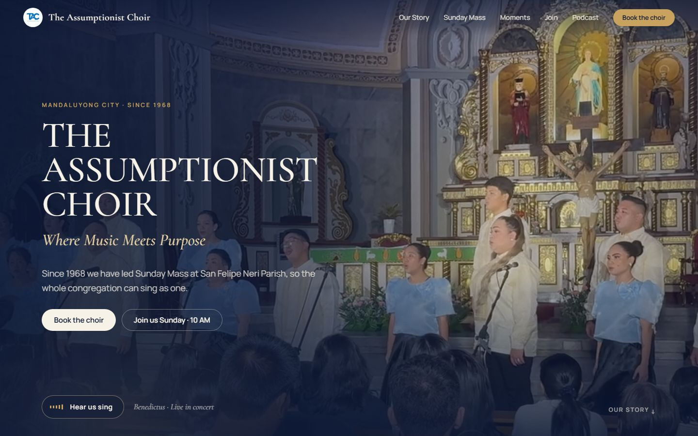
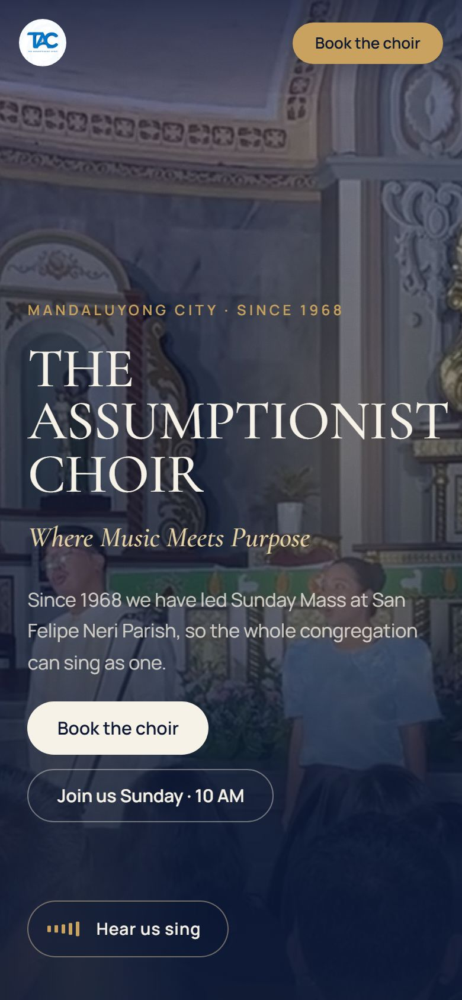

# The Assumptionist Choir — Website

**Live site → [siler1o.github.io/tac-website](https://siler1o.github.io/tac-website/)**

The official-style website for **The Assumptionist Choir (TAC)**, a liturgical choir founded in 1968 at San Felipe Neri Parish, Mandaluyong City. TAC leads the Sunday 10:00 AM Mass and performs at weddings, corporate events and seasonal concerts.

The goal: a site that feels like walking into the church on a Sunday morning. You *hear* the choir before you read about it, and the next step (attend Mass, join, or book them) is always one click away.

<p>
  
  
</p>

## Highlights

- **Live performance hero.** A muted loop of the choir singing the *Benedictus* at the altar. **Hear us sing** turns the sound on, and a five-bar gold sound wave follows the actual music through the Web Audio API.
- **Motion with meaning.**
  - Headlines rise word by word, like a sung phrase.
  - Photos open from the centre, like church doors.
  - A hand-drawn line illustration of San Felipe Neri draws itself in gold.
  - Music-staff dividers draw across the page and notes land on them.
  - A warm candlelight glow drifts behind the dark sections.
- **Real content only.** Facts, schedule, photos and video come from the choir's own Facebook, Instagram, YouTube and Spotify, plus press coverage from the Philippine Information Agency and the National Parks Development Committee. No invented testimonials or numbers.
- **Built to be used:**
  - the Sunday Mass time and monthly schedule
  - a "Join the choir" section with the real membership requirements
  - a booking form that opens the visitor's email app with details filled in
  - podcast links and every social channel

## Sections

| Section | What it does |
| :--- | :--- |
| Hero | Live performance video, title, tagline, *Hear us sing*, primary actions |
| Our Story | Founded 1968, the *Musicam Sacram* mission, three principles, key facts |
| Ethos band | Full-bleed film of the choir behind their guiding line |
| Sunday Mass | Time, address, directions and the current monthly schedule |
| Moments | Gloria in Harmony (Paco Park), Easter Vigil, Christmas events |
| Beyond the Choir Loft | Candid and recent rehearsal photos |
| Join | Membership call with a rehearsal clip and direct-message buttons |
| Book Us | Event types, contact numbers and the inquiry form |
| Podcast | *KabaliTACtakan* on Spotify and YouTube |

## Tech

- Plain **HTML, CSS and JavaScript**: no framework, no build step, no dependencies.
- CSS animations plus `IntersectionObserver` for reveals; SVG `pathLength` stroke drawing for the motion graphics.
- Background videos play only while on screen and pause when off screen.
- **Accessibility:**
  - all motion and autoplay switches off under `prefers-reduced-motion`
  - keyboard focus styles and a skip link
  - alt text on every photo
  - hidden copy is kept out of the reading order
- Media prepared with FFmpeg (trimmed, cropped, H.264 with `faststart`) and WebP stills. A few low-resolution photos were AI-upscaled and checked against the originals so faces stay true.
- Checked with **Playwright** screenshots at desktop (1440×900) and phone (390×844) sizes: no console errors, no horizontal scroll, every reveal fires.

## Run locally

```bash
python -m http.server 8000
```

Then open <http://localhost:8000>. Any static server works. The video sound wave needs the page served over HTTP, not opened as a file.

## Editing

| To change | Edit |
| :--- | :--- |
| Copy, schedule, links | `index.html`. The monthly schedule sits in the Sunday Mass section, marked `Update monthly`. |
| Colours, fonts, spacing | The variables at the top of `styles.css` |
| Photos and videos | `assets/img/` and `assets/video/`. Keep the same filenames, or update the paths in `index.html`. |

## Credits

Photos, video, music and the TAC logo belong to **The Assumptionist Choir** and are used with the choir's involvement. They are not covered by any licence for reuse.

Website designed and built by **Reuben Silerio**. Want a site like this?
[jhericosilerio@gmail.com](mailto:jhericosilerio@gmail.com) · [LinkedIn](https://www.linkedin.com/in/reuben-jherico-silerio-1aa2ba295/) · [GitHub](https://github.com/siler1o)
